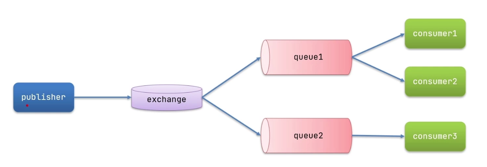

## 发布订阅模型

1. publisher 消息发布者
2. exchange 交换机，接受数据，然后根据配置的模式来发送给queue队列
3. queue 消息队列，放消息的地方
4. consumer 消息消费者



## exchange交换机的三种区别
- Fanout 广播
- Direct 路由
- Topic 话题

[区别就是。。。。](doc/readme.md)


## SpringAMQP消息转换器MessageConvert

默认的情况下，消息发送出去转换都是outputSteam，这种方式很低效，可以使用和springmvc一样的json来解析

```xml
<dependency>
    <groupId>com.fasterxml.jackson.core</groupId>
    <artifactId>jackson-databind</artifactId>
</dependency>
```

然后注入bean就有了,这个bean在消息发送者和接受者都需要注入

```java
@Bean
public MessageConverter messageConverter (){
    return new Jackson2JsonMessageConverter();
}
```

## SpringAMQP的序列化和反序列化是怎么实现的
- 利用MessageConvert实现的，默认使用的jdk的序列化
- 发送方和接收方必须使用相同的MessageConvert
- 建议使用Jackson的这个MessageConvert，在传输对象的时候更加的节省流量

